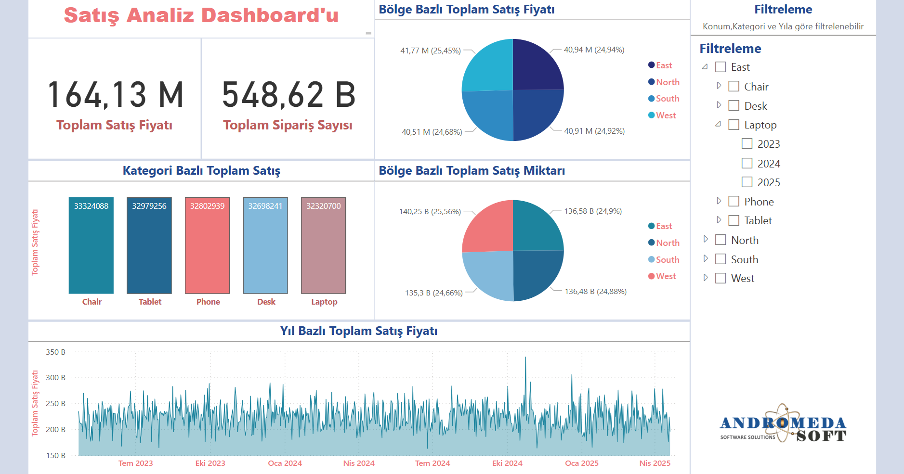

# 📊 Enterprise Sales Dashboard

## 🔍 Proje Özeti

Bu proje, SQL Server veritabanından alınan satış verilerini Power BI kullanarak interaktif bir dashboard halinde görselleştirmeyi amaçlar. Dashboard; kategori, bölge ve yıl bazında analizler sunar.

## 🗂️ Proje Yapısı

enterprise-sales-dashboard/
│
├── database/
│   ├── setup.sql
│   ├── insert-big-data.sql
│   ├── sp_sales_summary.sql
│   ├── sp_sales_report.sql
│
├── powerbi/
│   └── sales-analysis-dashboard.pbix
│
├── docs/
   ├── README.md
   └── screenshots/
       ├── sales-summary.png

## 🧩 Özellikler

- 📌 Kategori ve bölge bazlı satış analizleri
- 📈 Zaman serisi ile yıllık satış trendi
- 🧭 Filtreleme: Kategori, Bölge ve Yıl bazında
- 📊 KPI kartları, pasta grafikler, bar ve alan grafikler

## 🧪 Kurulum ve Kullanım

1. `database/setup.sql` ve `database/insert-big-data.sql` dosyasını SQL Server'da çalıştırın.
2. `sp_sales_summary.sql` dosyasını çalıştırarak prosedürü oluşturun.
3. Power BI'da `sales-analysis-dashboard.pbix` dosyasını açın.
4. SQL Server bağlantınızı ayarlayın ve verileri güncelleyin.

## 🖼️ Ekran Görüntüleri

| Genel Görünüm |
|---------------|
|  | !

## 👤 Geliştirici

**[Nalan ŞAHİN]**  
📧 [nalans08@gmail.com]  
🔗 [[GitHub](https://github.com/nalannnsahin) / [LinkedIn](https://www.linkedin.com/in/nalan-sahin/)]

